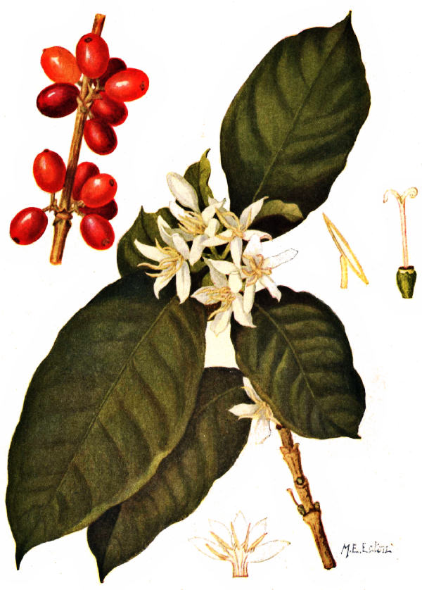

***Encomiums and descriptive phrases applied to the plant, the berry, and the beverage.***

####The Plant####

The precious plant  
This friendly plant  
Mocha's happy tree  
The gift of Heaven  
The plant with the jessamine-like flowers  
The most exquisite perfume of Araby the blest  
Given to the human race by the gift of the Gods  

[[image]]
| 
[[caption]]
| COFFEE ARABICA; LEAVES, FLOWERS AND FRUIT – Painted from nature by M.E. Eaton—Detail sketches show anther, pistil, and section of corolla

####The Berry####

The magic bean  
The divine fruit  
Fragrant berries  
Rich, royal berry  
Voluptuous berry  
The precious berry  
The healthful bean  
The Heavenly berry  
The marvelous berry  
This all-healing berry  
Yemen's fragrant berry  
The little aromatic berry  
Little brown Arabian berry  
Thought-inspiring bean of Arabia  
The smoking, ardent beans Aleppo sends  
That wild fruit which gives so beloved a drink  

####The Beverage####

Nepenthe  
Festive cup  
Juice divine  
Nectar divine  
Ruddy mocha  
A man's drink  
Lovable liquor  
Delicious mocha  
The magic drink  
This rich cordial  
Its stream divine  
The family drink  
The festive drink  
Coffee is our gold  
Nectar of all men  
The golden mocha  
This sweet nectar  
Celestial ambrosia  
The friendly drink  
The cheerful drink  
The essential drink  
The sweet draught  
The divine draught  
The grateful liquor  
The universal drink  
The American drink  
The amber beverage  
The convivial drink  
The universal thrill  
King of all perfumes  
The cup of happiness  
The soothing draught  
Ambrosia of the Gods  
The intellectual drink  
The aromatic draught  
The salutary beverage  
The good-fellow drink  
The drink of democracy  
The drink ever glorious  
Wakeful and civil drink  
The beverage of sobriety  
A psychological necessity  
The fighting man's drink  
Loved and favored drink  
The symbol of hospitality  
This rare Arabian cordial  
Inspirer of men of letters  
The revolutionary beverage  
Triumphant stream of sable  
Grave and wholesome liquor  
The drink of the intellectuals  
A restorative of sparkling wit  
Its color is the seal of its purity  
The sober and wholesome drink  
Lovelier than a thousand kisses  
This honest and cheering beverage  
A wine which no sorrow can resist  
The symbol of human brotherhood  
At once a pleasure and a medicine  
The beverage of the friends of God  
The fire which consumes our griefs  
Gentle panacea of domestic troubles  
The autocrat of the breakfast table  
The beverage of the children of God  
King of the American breakfast table  
Soothes you softly out of dull sobriety  
The cup that cheers but not inebriates[1]  
Coffee, which makes the politician wise  
Its aroma is the pleasantest in all nature  
The sovereign drink of pleasure and health[2]  
The indispensable beverage of strong nations  
The stream in which we wash away our sorrows  
The enchanting perfume that a zephyr has brought  
Favored liquid which fills all my soul with delight  
The delicious libation we pour on the altar of friendship  
This invigorating drink which drives sad care from the heart  